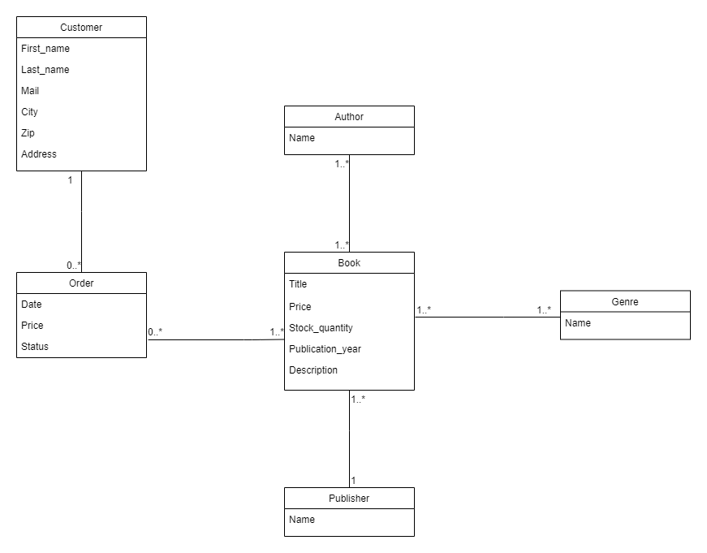
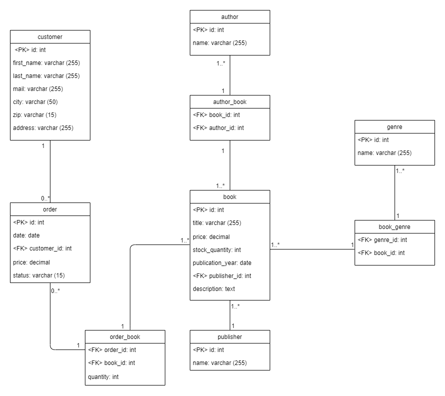

# Kníhkupectvo
Systém pre kníhkupectvo. Do tohto systému sa vedia dostať zákazníci aj administrátor.
Zákazníci si vedia pozrieť dostupné knihy a informácie o nich, pričom si dokážu vyhľadať a triediť podľa požadovaných atribútov.
Po vybraní kníh si zákazníci vedia vytvoriť objednávku a tú si následne pozrieť v histórii.
Admin si vie takisto prezerať dostupné knihy, no vie ich aj pridávať a editovať.
Administrátor má na starosti aj správu objednávok, a teda vybavovanie a zamietanie.

### Obsah
**[Technická realizácia](#technicka-realizacia)**<br>
**[Dátový model](#datovy-model)**<br>
**[Scenáre](#scenare)** <br>
**[Etapy](#etapy)([1](#etapa1), [2](#etapa2))** <br>
**[Práca s maven, flyway a konfigurácia](#navod)** <br>
**[Užitočné odkazy](#uzitocne_odkazy)** <br>


## Technická realizácia <a name="technicka-realizacia"></a>
### Frontend
Frontend predstavuje [JavaFX](https://openjfx.io/) aplikácia.
Aplikácia komunikuje s *backend-om* pomocou vlastnoručne písaných *controllerov*.
Pri vytváraní scén bol použitý [Scene Builder](https://gluonhq.com/products/scene-builder/), 
ktorý generuje [FXML](https://en.wikipedia.org/wiki/FXML) súbor.
Ten je napojený na *controller* danej scény. 
Pre štýl aplikácie bol použitý [CSS](https://en.wikipedia.org/wiki/Cascading_Style_Sheets).
### Backend
Backend je naprogramovaný v [Jave](https://www.java.com/en/).
Využívame [PostgreSQL](https://www.postgresql.org/) databázu.
Na migrácie využívame [Flyway](https://flywaydb.org/).
Na generovanie databázy využívame vlastnoručne písané seedery a [Java Faker](https://github.com/DiUS/java-faker).

## Dátový model <a name="datovy-model"></a>
### Logický model

### Fyzický model


## Scenáre <a name="scenare"></a>
1. **Výber kníh**(implementované v [1. etape](#etapa1)) <a name="scenar1"></a><br>
Tento scenár zahŕňa prezeranie si dostupných kníh zákazníkom aj administrátorom.<br>
Knihy si môžu zoradiť podľa názvu, vydavateľa, dátumu vydania, ceny ale vedia si knihu aj vyhľadať podľa názvu.
Po vybraní knihy sa im ukáže jej popis, autori a žáner.<br>
Výber kníh<br>
(a) **Zákaznikom** - 
zobrazí sa mu jej popis a následne bude vedieť prejsť na jej objednanie ([Scenár 3](#objednanie-knihy)). <br>
(b) **Adminstrátorom** - 
bude si ju vedieť takisto pozrieť ale ju aj spravovať ([Scenár 2](#sprava-knih))
2. **Správa kníh** <br> <a name="sprava-knih"></a>
K tomuto vie pristúpiť iba administrátor. <br>
Knihu vie: <br>
(a) **Pridať** -
pre pridanie bude musieť vyplniť potrebné informácie – názov, cenu, počet kusov, rok vydania, vydavateľa a popis knihy.
Vydavateľa aj autora si bude vedieť vybrať z dostupných alebo pridať nového.<br>
(b) **Odobrať** - odobratie knihy ju vymaže z databázy. <br>
(c) **Upraviť** - pri úprave bude môcť zmeniť jej množstvo alebo cenu.
3. **Objednanie knihy**(implementované v [2. etape](#etapa2))<br> <a name="objednanie-knihy"></a> <a name="scenar3"></a>
Objednať knihu si vie zákazník. Ku objednávke pristúpi po vybraní knihy zo zoznamu.
Vyplní jej množstvo a potvrdí objednanie.
Následne sa objednávka zaradí do histórie jeho objednávok a bude si vedieť pozrieť jej informácie – číslo, dátum, cenu, stav.
Taktiež v prípade že objednávka ešte nie je vybavená, bude ju vedieť zákazník zrušiť.
4. **Správa objednávok**(implementované v [2. etape](#etapa2)) <br> <a name="scenar4"></a>
Pristupuje k tomu administrátor. <br> 
Správa objednávok zahŕňa menenie jej stavu:<br>
(a) **Vybavená** - k vybaveniu dôjde v prípade, že nedošlo k žiadnemu problému na strane kníhkupectva. 
Závisí to od administrátora a vypĺňa sa to manuálne. <br>
(b) **Nevybavená** - začiatočný stav objednávky. <br>
(c) **Zamietnutá** - zamietnutá môže byť objednávka v prípade, že nastala situácia ktorá spôsobila vyčerpanie zásob danej knihy. 
Tento stav vyhodnocuje administrátor.
5. **Prihlásenie** <br>
Prihlasovania sú dve. Jedno pre administrátora a jedno pre zákazníka.
Na základe prihlasovacích údajov sa určia práva, ktoré budú používatelia v systéme mať. Tie sú popísané vo zvyšných scenároch.

## Etapy <a name="etapy"></a>
### Etapa 1 <a name="etapa1"></a>
Pre prvú etapu sme sa rozhodli implementovať [scenár 1](#scenar1). V aplikácií sa dajú zobraziť a vyhľadať knihy.
*Frontend* komunikuje s *backend-om* pomocou *controllerov*.
* BooksController vráti knihy z databázy v hashmape
* AuthorBookController vráti ID autorov s daným ID knihy alebo knihy s ID autora
* AuthorsController vráti autorov z databázy v hashmape
* BookGenreController vráti ID žánrov, danej knihy
* GenreController vráti žánre z databázy v hashmape
#### Práca s programom
Pri zapnutí programu je potrebné sa prihlásiť. 
Keďže tento scenár (prihlásenie) ešte nemáme implementovaný, pre prihlásenie sa ako užívateľ treba do kolónky name napísať “user”.
Pre prihlásenie sa ako administrátor tam treba zadať “admin”. Obe tieto rozhrania sa zatiaľ funkčne rovnajú.
Zobrazí sa tabuľka, do ktorej sa z databázy načítajú všetky knihy a informácie k nim. 
Vľavo od tabuľky je textové pole, do ktorého sa zadáva názov knihy, ktorá sa v tabuľke vyhľadá.
Pod týmto hľadaním sa zobrazuje obsah knihy. Pre jeho zobrazenie je potrebné si v tabuľke vybrať knihu.
#### Práca s jayzkom SQL
**Príklad migrácií**
```sql
-- src/main/resources/db/migration/V1.1__Create_customers_table.sql
CREATE TABLE customers (
    id SERIAL PRIMARY KEY,
    first_name VARCHAR(255) NOT NULL,
    last_name VARCHAR(255) NOT NULL,
    mail VARCHAR(255) NOT NULL,
    city VARCHAR(50),
    zip VARCHAR(15),
    address VARCHAR(255)
);
```
```sql
-- src/main/resources/db/migration/V1.2__Create_orders_table.sql
CREATE TABLE orders (
    id SERIAL PRIMARY KEY,
    date DATE NOT NULL,
    customer_id INT NOT NULL,
    price DECIMAL(6, 2),
    status VARCHAR(15) NOT NULL,
    CONSTRAINT fk_customer_order
        FOREIGN KEY(customer_id)
        REFERENCES customers(id)
        ON UPDATE CASCADE
        ON DELETE CASCADE
);
```
**Príklad napĺňania tabuľky generovanými údajmi pomocou java faker** <a name ="priklad_faker"></a>
Pri spustení seederu sa vygenerujú informácie o zákazníkovi a vložia sa do databázy.
```java
//src/main/java/database/seeders/CustomersSeeder.java
public class CustomersSeeder {
    public static void run(Connection connection, Integer count, Faker faker) throws SQLException {
        String query = "INSERT INTO customers " +
                "(first_name, last_name, mail, city, zip, address) " +
                "VALUES (?, ?, ?, ?, ?, ?)";
        PreparedStatement statement = connection.prepareStatement(query);
        Database.emptyTable("customers");
        while(count-- > 0) {
            statement.setString(1, faker.name().firstName());
            statement.setString(2, faker.name().lastName());
            statement.setString(3, faker.internet().emailAddress());
            statement.setString(4, faker.address().city());
            statement.setString(5, faker.address().zipCode());
            statement.setString(6, faker.address().streetAddress());
            statement.executeUpdate();
        }
        statement.close();
    }
}
```
### Etapa 2 <a name="etapa2"></a>
Pre druhú etapu sme sa rozhodli implementovať [3.](#scenar3) a [4.](#scenar4) scenár.
Oba tieto scenáre medzi sebou súvisia. Zákazník si vie knihy objednať, 
pristupovať k histórii svojich objednávok a administrátor ich vie spravovať - vybaviť a zamietnuť.
#### Napĺňanie tabuliek
V tejto etape sme mali taktiež naplniť jednu tabuľku s milión dátami. Rozhodli sme sa tak naplniť *orders* tabuľku.
Ostatné sú naplnené so 100 000 dátami. 
Tie sme generovali pomocou java faker tak ako aj v [1. etape](#etapa1), kde je [príklad kódu](#priklad_faker). 
#### Netriviálne dopyty
##### Zoraďovanie kníh podľa popularity
Zákazník má možnosť zoradiť si knihy podľa popularity zostupne aj vzostupne a ukáže mu tie, ktoré sú na sklade, boli objednané aspoň raz a zoradené podľa počtu objednaní.
```java
//src/main/java/controller/BooksController.java
query = String.format("SELECT b.*, p.name publisher_name " +
               "FROM order_book ob " +
               "JOIN books b ON ob.book_id = b.id " +
               "JOIN publishers p ON p.id=b.publisher_id " +
               "WHERE b.stock_quantity>0 " +
               "GROUP BY b.id, p.name " +
               "HAVING COUNT(ob.book_id)>=1 " +
               "ORDER BY COUNT(ob.book_id) %s " +
               "OFFSET %s ROWS " +
               "FETCH FIRST %s ROWS ONLY;", order, offset, booksPerPage);
```
##### Zobrazenie najlepších zákazníkov
Administrátorovi sa pri prístupe k objednávkam zobrazia ID troch zákazníkov s najvyšším počtom vybavených objednávok, pričom ich musí byť aspoň 5.
```java
//src/main/java/controller/CustomerController.java
String query = "SELECT c.id FROM customers c " +
                "JOIN orders o ON c.id=o.customer_id " +
                "WHERE o.status='vybavená' " +
                "GROUP BY c.id " +
                "HAVING COUNT(c.id)>=5 " +
                "ORDER BY COUNT(c.id) DESC " +
                "LIMIT ?";
```
#### Práca s programom
##### Zákazník
Pri prihlásení sa zadáva iba ID zákazníka (čísla medzi 1 - 100 000), za ktorého sa chceme prihlásiť, nakoľko login scenár ešte nemáme implementovaný.
Po prihlásení sa zákazníkovi zobrazia knihy. Ak na nejakú knihu klikne, môže následne stlačiť tlačidlo __*Add to order*__.
Toto priradí zvolenú knihu do jeho novo vytváranej objednávky. K objednaní pristupuje po stlačení __*Make order*__. 
Zobrazí sa mu okno, kde vidí knihy vo svojej objednávke. Vie zmeniť ich počet (Tlačidlo __*Change quantity*__ a pole pre zadanie počtu),
odobrať knihu z objednávky, dokončiť objednávku alebo ju zrušiť. Po dokončení objednávky sa zaradí do __*Orders history*__.
V nej zákazník vidí svoje objednávky, ich stav a po kliknutí na nejakú aj jej detaily. 
V prípade že objednávka ešte nieje vybavená, môže ju zákazník zrušiť.
##### Administrátor
Prihlasuje sa zadaním *admin* do kolónky *name*. Po pristúpení do časti __*Orders*__ zadáme ID zákazníka, ktorého objednávky chceme vybaviť.
Zobrazia sa nám, podobne ako pri zákazníkovi, jeho objednávky so statusom a po kliknutí na nejakú aj jej detaily.
Administrátor následne vie vybranú objednávku vybaviť alebo zamietnuť, pokiaľ je ešte nevybavená.

### Práca s maven, flyway a konfigurácia <a name="navod"></a>
* V *src/main/resources/* sa nachádza vzorový súbor *configuration_example.properties* kde je konfigurácia pre pripojenie do databázy.
Je potrebné tam zadať usera, heslo a url k databáze a premenovať ho z *configuration_example.properties* na *configuration.properties*.
* V *pom.xml* v časti *\<properties>* je potrebné nastaviť údaje rovnako ako v *configuration.properties* 
    * *\<database.url>* - url k databáze
    * *\<database.user>* - user na prístup k databáze
    * *\<database.password>* - heslo k databáze
* [Flyway](https://flywaydb.org/) sa používa pomocou [Maven](https://maven.apache.org/what-is-maven.html)
 (pred používaním príkazov *flyway* je potrebné spustiť príkaz *mvn install*
  * *mvn flyway:info* vypíše informácie o stave migrácií
  * *mvn flyway:baseline* vytvorí baseline verziu migrácií(používa sa na prázdnu databázu)
  * *mvn flyway:migrate* vytvorí tabuľky v databáze v poradí od najstaršej po najnovšiu verziu
  * *mvn flyway:clean* vymaže všetko z databázy
* Údaje v databáze sa generujú spustením *src/main/java/database/Seeder.java* 
ktorý naplní databázu údajmi generovanými pomocou [Java Faker](https://github.com/DiUS/java-faker) ([Príklad seederu](#priklad_faker))
* Program sa spúšťa spustením *src/main/java/Main.java*

### Užitočné odkazy <a name="uzitocne_odkazy"></a>
[Github Classroom](https://github.com/FIIT-DBS2020/project-rauchova_nisky) <br>
[Github Repository](https://github.com/Marian-N/Knihkupectvo) <br>
[Flyway](https://flywaydb.org/) <br>
[PostgreSQL](https://www.postgresql.org/) <br>
[JavaFX](https://openjfx.io/) <br>
[Java Faker](https://github.com/DiUS/java-faker) <br>
[Maven](https://maven.apache.org/what-is-maven.html)

